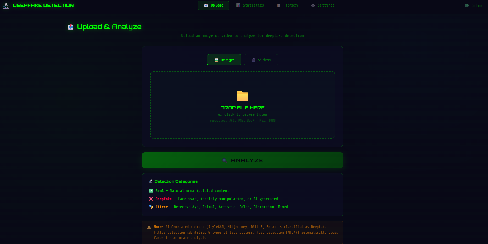

# 🔬 Deepfake Detection System

> AI-Powered Image & Video Analysis Using Deep Learning

A comprehensive web-based deepfake detection system built with **EfficientNet-B4** and **MTCNN** face detection preprocessing. The system detects manipulated facial imagery with **99.36% accuracy** and identifies facial filter types with **98.93% accuracy**.

---

## 🎯 Features

- **Deepfake Detection** — Binary classification (Real vs Deepfake) with 99.36% validation accuracy
- **Filter Detection** — Identifies 7 filter categories (clean, age, animal, artistic, color, distortion, mixed) with 98.93% accuracy
- **Face Detection Preprocessing** — MTCNN automatic face detection and cropping for real-world images
- **Video Analysis** — Frame-by-frame deepfake detection (20 frames, 40% threshold)
- **Preprocessing Transparency** — Shows users exactly how their image was processed
- **Detection History** — Searchable, filterable history of all past detections
- **Statistics Dashboard** — Real-time stats, model info, and detection trends
- **Dark/Light Mode** — Toggle between themes
- **Responsive Design** — Desktop, tablet, and mobile support
- **GPU Accelerated** — CUDA-powered inference on NVIDIA GPUs

--- 

## 🏗️ Architecture

```
Frontend (HTML/CSS/JS)  →  Flask API  →  AI Engine (PyTorch + MTCNN)
                                ↓
                           SQLite DB
```

| Layer | Technology | Purpose |
|-------|-----------|---------|
| AI/ML | EfficientNet-B4 (PyTorch 2.5.1) | Image classification |
| Face Detection | MTCNN (facenet-pytorch) | Face cropping preprocessing |
| Backend | Flask (Python) | REST API |
| Database | SQLite | Detection history & settings |
| Frontend | HTML5, CSS3, JavaScript | Responsive SPA |
| Video | OpenCV | Frame extraction |
| GPU | NVIDIA CUDA 12.1 | Accelerated inference |

---

## 📊 Model Performance

### Deepfake Detection Model
| Metric | Value |
|--------|-------|
| Architecture | EfficientNet-B4 (18.6M params) |
| Validation Accuracy | **99.36%** |
| Deepfake Class | 99.31% |
| Real Class | 99.41% |

### Filter Detection Model
| Metric | Value |
|--------|-------|
| Architecture | EfficientNet-B4 (18.6M params) |
| Validation Accuracy | **98.93%** |
| Classes | clean, age, animal, artistic, color, distortion, mixed |

---

## 📁 Project Structure

```
deepfake-gpu/
├── backend/
│   ├── app.py                          # Flask API server
│   ├── services/
│   │   ├── detection_service.py        # V3 Detection engine
│   │   └── video_analyzer_v2.py        # Video frame analysis
│   ├── models/saved_models/
│   │   ├── deepfake_2class_v2.pth      # Deepfake model (99.36%)
│   │   └── filter_detector_v1.pth      # Filter model (98.93%)
│   ├── data/
│   │   └── detections.db               # SQLite database
│   └── uploads/                        # Uploaded files
├── frontend/
│   └── index.html                      # SPA dashboard
├── train_v2.py                         # Deepfake model training
├── train_filter.py                     # Filter model training
├── requirements.txt                    # Python dependencies
└── README.md
```

---

## 🚀 Installation

### Prerequisites
- Python 3.10+
- NVIDIA GPU with CUDA 12.1 (6GB+ VRAM for inference, 12GB+ for training)

### Setup

```bash
# Clone the repository
git clone https://github.com/YOUR_USERNAME/deepfake-detection-system.git
cd deepfake-detection-system

# Create virtual environment
python -m venv venv

# Activate (Windows)
.\venv\Scripts\activate

# Activate (Linux/Mac)
source venv/bin/activate

# Install PyTorch with CUDA
pip install torch==2.5.1+cu121 torchvision==0.20.1+cu121 torchaudio==2.5.1+cu121 --index-url https://download.pytorch.org/whl/cu121

# Install dependencies
pip install -r requirements.txt

# Install face detection (without breaking CUDA)
pip install facenet-pytorch --no-deps
```

### Run

```bash
python backend/app.py
```

Open `http://localhost:5000` in your browser.

---

## 🔌 API Endpoints

| Method | Endpoint | Description |
|--------|----------|-------------|
| `POST` | `/api/detect` | Upload and analyze image/video |
| `GET` | `/api/stats` | System statistics and model info |
| `GET` | `/api/history` | Detection history (paginated) |
| `DELETE` | `/api/detection/<id>` | Delete a detection record |
| `GET` | `/api/settings` | Get system settings |
| `POST` | `/api/settings` | Update system settings |

---

## 📦 Dataset

Trained on **243,968 images** from:

| Category | Count | Source |
|----------|-------|--------|
| Real | 50,000 | FFHQ, CelebA (Kaggle) |
| Deepfake | 50,000 | FaceForensics++, DFDC (Kaggle) |
| AI-Generated | 30,000 | StyleGAN (Kaggle) |
| Filtered | 113,968 | Custom Python scripts (6 filter types) |

---

## 🧠 How It Works

```
Image Upload → MTCNN Face Detection → Crop + Pad (30%)
     → Resize 380x380 → Center Crop 299x299 → Normalize
     → EfficientNet-B4 (Deepfake) → Real/Deepfake + Confidence
     → EfficientNet-B4 (Filter) → Filter Type + Probabilities
     → Save to SQLite → Return Results to Frontend
```

---

## 👥 Team

| Name | Student ID |
|------|-----------|
| Jarallah Al-Jarallah | 441101158 |
| Mohammed Al-Tawala | 441101679 |
| Basel Al-Salem | 441101290 |
| Abdulmajeed Al-Faheed | 441101631 |

**Supervisor:** Dr. Wael Khader

**Majmaah University** — College of Computer and Information Sciences — 2025-2026


